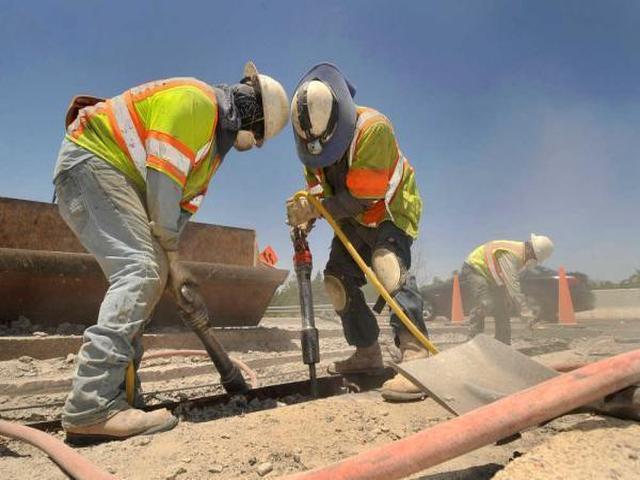
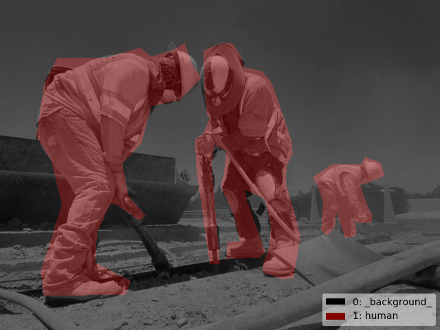

# construction-site-segmentation

An open dataset for semantic segmentation on construction sites, released by the paper: *Deep Semantic Segmentation for Visual Understanding on Construction Sites*.   

All images were collected from online. For research purpose only. No commercial use.

The raw data and the labels could be found below:

| Source                                                       | Code |
| ------------------------------------------------------------ | ---- |
| [Baidu Cloud](https://pan.baidu.com/s/15zkzYspUaimroePCJfy5-A) | 0ito |

We acknowledge [LabelMe](https://github.com/wkentaro/labelme) for providing the labeling tool.

